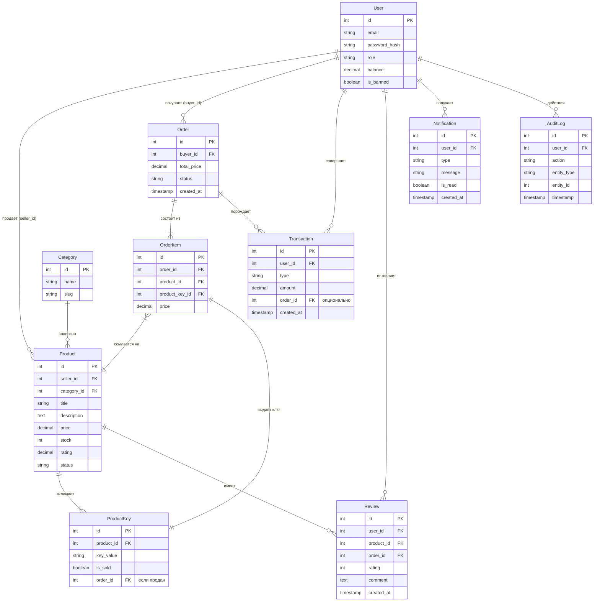
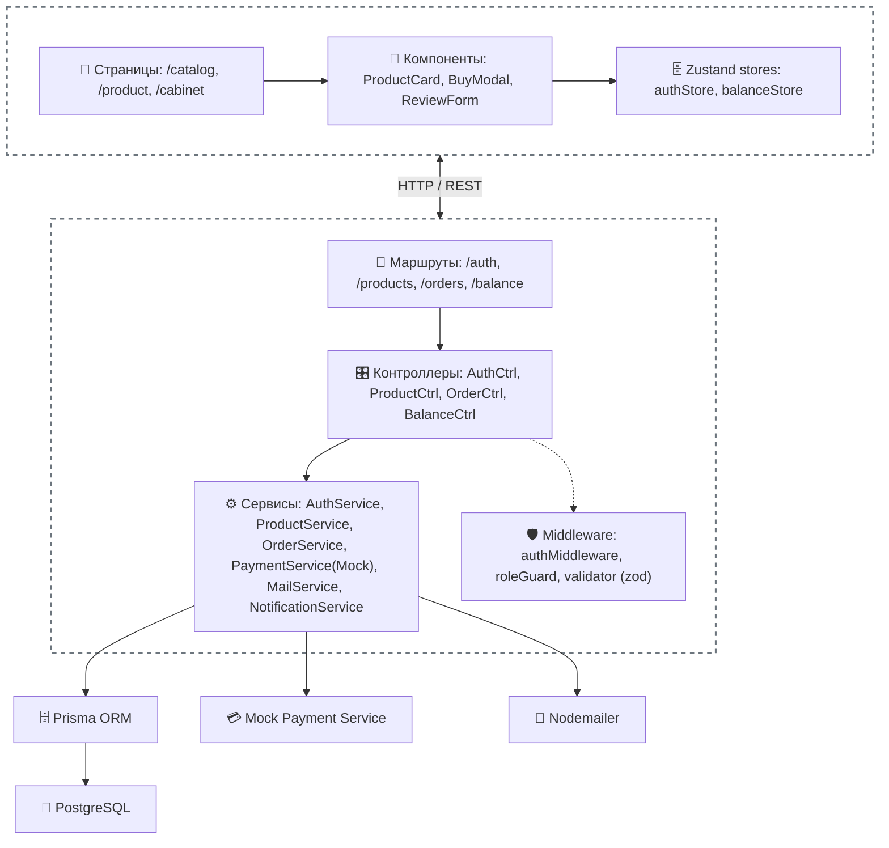
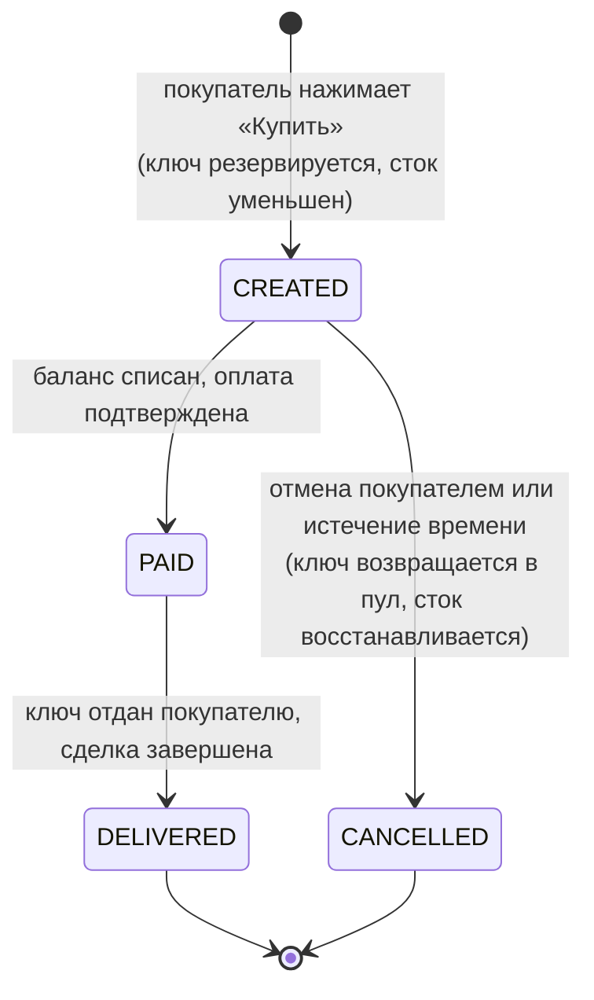

# KeyMarket — Маркетплейс цифровых товаров

Платформа для продажи и покупки цифровых товаров (ключи игр, подписки, аккаунты) с внутренним балансом, комиссией сервиса и автоматической выдачей ключа после оплаты.

## 📦 Стек технологий

| Слой           | Технологии                                                        |
|----------------|-------------------------------------------------------------------|
| Frontend       | React 19, TypeScript, React Router v6, Zustand, Ant Design        |
| Backend        | Node.js, Fastify                                                  |
| Database       | PostgreSQL                                                        |
| Инфраструктура | Docker                                                            |
| Документация   | Swagger / OpenAPI                                                 |
| Тесты          | Jest, Supertest (backend), React Testing Library (frontend)       |
| Доп. API       | Пока что не определены                                            |

## 📋 Описание проекта

### Идея
Сегодня торговля цифровыми товарами (ключи игр, подписки, аккаунты) сконцентрирована либо
в соцсетях и мессенджерах без всяких гарантий, либо на крупных площадках. Однако существующие маркетплейсы обладают рядом серьёзных минусов:

❌ **Высокие комиссии** — комиссия сервиса часто достигает 10–20%, что съедает прибыль продавца
и увеличивает конечную цену для покупателя.

❌ **Задержки выплат** — продавцы ждут вывода средств от нескольких дней до недель,
а служба поддержки отвечает медленно.

❌ **Отсутствие прозрачности** — непонятно, как именно резервируются ключи,
обрабатываются возвраты и решаются спорные ситуации. Механики «чёрного ящика» снижают доверие.

❌ **Риски мошенничества** — нет чёткого механизма гарантии, что ключ будет доставлен
после оплаты, а продавец получит свои деньги только после подтверждения выдачи.

**KeyMarket** создан, чтобы устранить эти проблемы. Это прозрачный маркетплейс
цифровых товаров с **низкой фиксированной комиссией**, **мгновенной автоматической выдачей ключа**
после оплаты, **понятной статусной моделью сделки** и **открытой архитектурой**,
где все денежные потоки видны в личном кабинете. Платформа выступает надёжным посредником,
а не «чёрным ящиком».

### Целевая аудитория
- **Продавцы** — владельцы ключей, аккаунтов, подписок, желающие быстро продать их с минимальными издержками.
- **Покупатели** — пользователи, которым нужны цифровые товары по привлекательным ценам с гарантией получения.
- **Администраторы** — управляют контентом и разрешают споры.

## 🖥 Ключевые экраны и функциональность

### Для покупателя (роль: buyer)
| Экран              | Что можно делать |
|--------------------|------------------|
| Главная            | Поиск товаров по названию, фильтр по категории, цене, сортировка |
| Карточка товара    | Описание, цена, рейтинг, отзывы, кнопка «Купить» |
| Покупка            | Проверка баланса → списание → получение ключа на странице заказа |
| Личный кабинет     | Профиль, баланс, история заказов, история транзакций, уведомления |
| Пополнение баланса | Выбор суммы → оплата → зачисление |

### Для продавца (роль: seller)
| Экран                  | Что можно делать |
|------------------------|------------------|
| Дашборд                | Общая статистика: продажи за сегодня, баланс, количество активных товаров |
| Управление товарами    | CRUD товаров: название, описание, категория, цена, загрузка пула ключей |
| Мои заказы             | Список проданных товаров, фильтр по дате/статусу |
| Запрос на вывод средств| Создание заявки на вывод с баланса |
| Профиль                | Редактирование данных, контакты |

### Для администратора (роль: admin)
| Экран        | Что можно делать |
|--------------|------------------|
| Admin-панель | Управление пользователями (бан/разбан, изменение роли), товарами (скрытие/блокировка), заказами (ручная смена статуса), просмотр логов |

## ✨ Уникальные фичи
- **Статусная модель заказа** — создан → оплачен → выполнен (ключ выдан), с возможностью отмены на раннем этапе.
- **Пулы ключей** — продавец загружает несколько ключей для одного товара; при покупке система выбирает случайный ключ и отправляет его покупателю.
- **Комиссия сервиса** — площадка удерживает процент с каждой продажи (настраивается).
- **Email и in-app уведомления** — о регистрации, смене статуса заказа, пополнении баланса, новых отзывах.
- **Рейтинг и отзывы** — покупатель может оценить товар и оставить комментарий после успешной покупки.
- **Поиск и фильтрация с пагинацией** — удобный каталог с поддержкой сортировки по цене, дате, рейтингу.

## 🗂 Сущности системы

| Сущность      | Ключевые поля |
|---------------|---------------|
| User          | id, email, password_hash, role (buyer/seller/admin), balance, avatar_url, is_banned |
| Category      | id, name, slug |
| Product       | id, seller_id (FK), category_id (FK), title, description, price, stock (вычисляемое), rating, status (active/inactive/banned) |
| ProductKey    | id, product_id (FK), key_value, is_sold, order_id (FK, если продан) |
| Order         | id, buyer_id (FK), total_price, status (created/paid/delivered/cancelled), created_at |
| OrderItem     | id, order_id (FK), product_id (FK), product_key_id (FK), price |
| Transaction   | id, user_id (FK), type (replenishment/purchase/sale/withdrawal/commission), amount, order_id (FK), created_at |
| Review        | id, user_id (FK), product_id (FK), order_id (FK), rating, comment, created_at |
| Notification  | id, user_id (FK), type, message, is_read, created_at |
| AuditLog      | id, user_id (FK), action, entity_type, entity_id, timestamp |

## 🗃 ER-диаграмма


## 🏗 Архитектура системы



## 🔄 Статусная модель заказа (Order)



## 👤 User Stories

- **Как покупатель**, я хочу найти нужный цифровой товар по названию и категории, чтобы быстро совершить покупку.
- **Как покупатель**, я хочу получить купленный ключ сразу после оплаты, без ожидания подтверждения продавцом.
- **Как покупатель**, я хочу видеть историю своих покупок и оставлять отзывы, чтобы делиться опытом.
- **Как продавец**, я хочу загружать пул ключей для одного товара, чтобы продавать массово.
- **Как продавец**, я хочу отслеживать статистику продаж и выводить заработанные средства.
- **Как администратор**, я хочу управлять пользователями и товарами, а также видеть все транзакции для разрешения спорных ситуаций.

## 🗺 План действий (10 недель)

| Неделя | Этап                        | Основные задачи                                                                                                     |
|--------|-----------------------------|---------------------------------------------------------------------------------------------------------------------|
| 1-2    | 🟢 Минимальный функционал   | Инициализация проектов, настройка БД, аутентификация/авторизация, CRUD товаров, простая покупка (без статусов)     |
| 3-4    | 🟡 Роли, админка, комиссия  | Роли (buyer, seller, admin), админ-панель, комиссия с продаж, Mock-пополнение баланса через интерфейс, улучшенный UI |
| 5-6    | 🔵 Статусная модель и пулы  | Статусная модель заказа, холдирование ключей, пулы ключей, email/in-app уведомления, система отзывов              |
| 7-8    | 🔵 Тесты, документация      | Unit и интеграционные тесты, Swagger-документация, Docker Compose, деплой на Render / VPS                          |
| 9-10   | Финализация                 | Подготовка сид-данных, презентация, архитектурные схемы, доработка UX, отладка, защита                             |

## 🚀 Как запустить локально

```bash
# 1. Клонировать репозиторий
git clone https://github.com/username/keymarket.git
cd keymarket

# 2. Создать .env файлы (примеры ниже)
cp backend/.env.example backend/.env
cp frontend/.env.example frontend/.env

# 3. Запустить через Docker Compose
docker compose up --build

Приложение будет доступно:

Frontend: http://localhost:5173

Backend API: http://localhost:3000

Swagger: http://localhost:3000/api-docs

📁 Структура проекта

keymarket/
├── frontend/
│   ├── src/
│   │   ├── pages/          # Каталог, товар, ЛК, админка
│   │   ├── components/     # ProductCard, BuyModal, Layout и т.д.
│   │   ├── stores/         # Zustand: authStore, productStore
│   │   ├── api/            # HTTP-клиент и методы
│   │   ├── types/          # TypeScript типы
│   │   └── utils/          # форматирование, константы
│   └── ...
├── backend/
│   ├── src/
│   │   ├── routes/         # auth.routes, product.routes, order.routes ...
│   │   ├── controllers/    # обработчики запросов
│   │   ├── services/       # AuthService, ProductService, OrderService, PaymentService
│   │   ├── middleware/      # auth, roleGuard, validate
│   │   ├── validators/     # zod схемы
│   │   ├── prisma/         # schema.prisma, migrations, seed
│   │   ├── utils/          # jwt, email, logger
│   │   └── app.ts          # инициализация Fastify
│   └── ...
├── docker-compose.yml
└── README.md
```

💡 Ссылки:
🔗 Репозиторий: https://github.com/Zamchik/Final_Project

📋 Доска задач: Linear/Notion

🎨 Figma: макеты экранов
